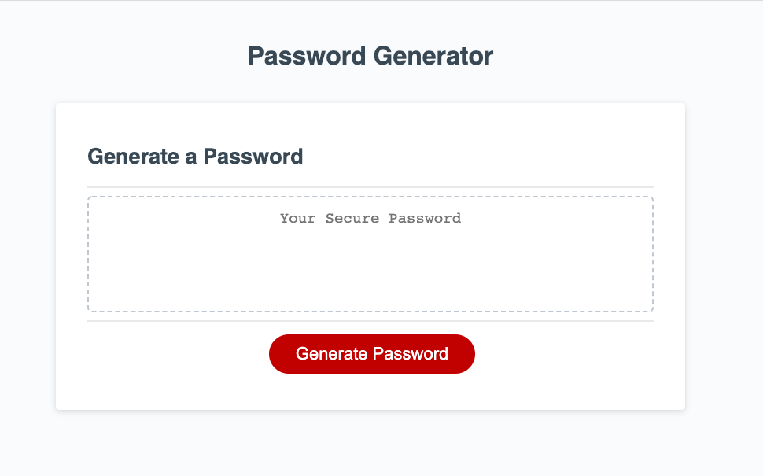

# pw-generator
Homework 3: Password Generator

## Summary
This application is a basic password generator. In order to utilize this took, the user is asked to determine the following: 

- prefered password length
- whether they want lower case letters
- whether they want upper case letters
- whether they want numbers 
- whether they want special characters

After the criteria is established, the password will appear in the text box on the page.

Link: https://masielb.github.io/pw-generator/

## Site Picture 

## Built With
* [HTML](https://developer.mozilla.org/en-US/docs/Web/HTML)
* [CSS](https://developer.mozilla.org/en-US/docs/Web/CSS)
* [JavaScript](https://developer.mozilla.org/en-US/docs/Web/JavaScript)
* [Boostrap](https://getbootstrap.com/)
